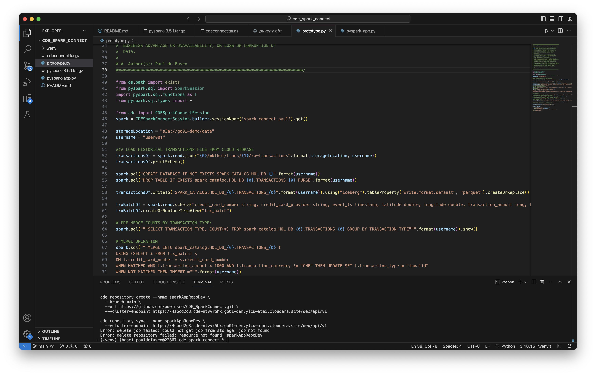

# CDE Spark Connect

1. Test jobs with Spark Connect from local.  
2. Once ready for operationalization push to git.
3. Sync with CDE repository
4. Deploy using CLI
5. Monitor
6. Promote to higher env using API by replicating repo and redeploy
7. Deploy Airflow Orchestration Pipeline

We will prototype and test the Iceberg Merge Into and Incremental Read Operations.

# Instructions

## 1. Test jobs in CDE Session from local

Start a CDE Session of type Spark Connect. Then, run "prototype.py".



On your terminal run the following commands:

```
cde spark submit \
  pyspark-app.py \
  --vcluster-endpoint https://4spcd2c8.cde-ntvvr5hx.go01-dem.ylcu-atmi.cloudera.site/dex/api/v1 \
  --executor-memory "4g" \
  --executor-cores 2
```

You are ready to test the Spark Submit as a CDE Spark Job.

## 2. Push to git

This code is looking good. Let's push updates to the git repo.

```
git add pyspark-app.py
git commit -m "developed pyspark job"
git push
```

We can now create a CDE Repository in order to import the application into the Virtual Cluster.

## 3. Sync with CDE repository

Create a CDE repository and create the CDE Spark Job using the contents.

```
cde job delete \
  --name cde_spark_job_test \
  --vcluster-endpoint https://4spcd2c8.cde-ntvvr5hx.go01-dem.ylcu-atmi.cloudera.site/dex/api/v1

cde repository delete \
  --name sparkAppRepoDev \
  --vcluster-endpoint https://4spcd2c8.cde-ntvvr5hx.go01-dem.ylcu-atmi.cloudera.site/dex/api/v1

cde repository create --name sparkAppRepoDev \
  --branch main \
  --url https://github.com/pdefusco/CDE_SparkConnect.git \
  --vcluster-endpoint https://4spcd2c8.cde-ntvvr5hx.go01-dem.ylcu-atmi.cloudera.site/dex/api/v1

cde repository sync --name sparkAppRepoDev \
  --vcluster-endpoint https://4spcd2c8.cde-ntvvr5hx.go01-dem.ylcu-atmi.cloudera.site/dex/api/v1
```

## 4. Deploy using CLI

```
cde job create --name cde_spark_job_test \
  --type spark \
  --mount-1-resource sparkAppRepoDev \
  --executor-cores 2 \
  --executor-memory "4g" \
  --application-file code/pyspark_example/pyspark-app.py\
  --vcluster-endpoint https://898n992w.cde-vwkzdqwc.paul-aug.a465-9q4k.cloudera.site/dex/api/v1

cde job run --name cde_spark_job_test \
  --executor-cores 4 \
  --executor-memory "2g" \
  --vcluster-endpoint https://898n992w.cde-vwkzdqwc.paul-aug.a465-9q4k.cloudera.site/dex/api/v1

cde job run --name cde_spark_job_test \
  --executor-cores 2 \
  --executor-memory "4g" \
  --vcluster-endpoint https://898n992w.cde-vwkzdqwc.paul-aug.a465-9q4k.cloudera.site/dex/api/v1
```

## 5. Monitor

Navigate to the Job Runs UI / run a few CDE CLI commands to check status.

```
# List all Jobs in the Virtual Cluster:
cde job list \
  --vcluster-endpoint https://898n992w.cde-vwkzdqwc.paul-aug.a465-9q4k.cloudera.site/dex/api/v1

# List all jobs in the Virtual Cluster whose name is "cde_spark_job_test":
cde job list \
  --filter 'name[eq]cde_spark_job_test' \
  --vcluster-endpoint https://898n992w.cde-vwkzdqwc.paul-aug.a465-9q4k.cloudera.site/dex/api/v1

# List all jobs in the Virtual Cluster whose job application file name equals "code/pyspark_example/pyspark-app.py":
cde job list \
  --filter 'spark.file[eq]code/pyspark_example/pyspark-app.py' \
  --vcluster-endpoint https://898n992w.cde-vwkzdqwc.paul-aug.a465-9q4k.cloudera.site/dex/api/v1

# List all runs for Job "cde_spark_job_test":
cde run list \
  --filter 'job[eq]cde_spark_job_test' \
  --vcluster-endpoint https://898n992w.cde-vwkzdqwc.paul-aug.a465-9q4k.cloudera.site/dex/api/v1
```

## 6. Promote to higher env using API by replicating repo and redeploy

Now that the job has succeeded, import it into the PRD cluster.

Create and sync the same Git repo from the PRD Cluster:

```
cde job delete \
  --name cde_spark_job_prd \
  --vcluster-endpoint https://vtr4tm46.cde-vwkzdqwc.paul-aug.a465-9q4k.cloudera.site/dex/api/v1

cde repository delete \
  --name sparkAppRepoPrd \
  --vcluster-endpoint https://vtr4tm46.cde-vwkzdqwc.paul-aug.a465-9q4k.cloudera.site/dex/api/v1

cde repository create --name sparkAppRepoPrd \
  --branch main \
  --url https://github.com/pdefusco/CDE_CICD_Articles.git \
  --vcluster-endpoint https://vtr4tm46.cde-vwkzdqwc.paul-aug.a465-9q4k.cloudera.site/dex/api/v1

cde repository sync --name sparkAppRepoPrd \
 --vcluster-endpoint https://vtr4tm46.cde-vwkzdqwc.paul-aug.a465-9q4k.cloudera.site/dex/api/v1

cde job create --name cde_spark_job_prd \
  --type spark \
  --mount-1-resource sparkAppRepoPrd \
  --executor-cores 2 \
  --executor-memory "4g" \
  --application-file code/pyspark_example/pyspark-app.py\
  --vcluster-endpoint https://vtr4tm46.cde-vwkzdqwc.paul-aug.a465-9q4k.cloudera.site/dex/api/v1

cde job run --name cde_spark_job_prd \
  --executor-cores 4 \
  --executor-memory "2g" \
  --vcluster-endpoint https://vtr4tm46.cde-vwkzdqwc.paul-aug.a465-9q4k.cloudera.site/dex/api/v1
```

## 7. Build Orchestration Pipeline with Airflow

```
cde job delete \
  --name airflow-orchestration \
  --vcluster-endpoint https://vtr4tm46.cde-vwkzdqwc.paul-aug.a465-9q4k.cloudera.site/dex/api/v1

cde job delete \
  --name cde_spark_job_gold \
  --vcluster-endpoint https://vtr4tm46.cde-vwkzdqwc.paul-aug.a465-9q4k.cloudera.site/dex/api/v1

cde job delete \
  --name cde_spark_job_silver \
  --vcluster-endpoint https://vtr4tm46.cde-vwkzdqwc.paul-aug.a465-9q4k.cloudera.site/dex/api/v1

cde job delete \
  --name cde_spark_job_bronze \
  --vcluster-endpoint https://vtr4tm46.cde-vwkzdqwc.paul-aug.a465-9q4k.cloudera.site/dex/api/v1

cde repository sync --name sparkAppRepoPrd \
 --vcluster-endpoint https://vtr4tm46.cde-vwkzdqwc.paul-aug.a465-9q4k.cloudera.site/dex/api/v1

cde job create --name cde_spark_job_bronze \
  --type spark \
  --arg pauldefusco \
  --arg s3a://paul-aug26-buk-a3c2b50a/data/spark3_demo/pdefusco/icedemo \
  --mount-1-resource sparkAppRepoPrd \
  --python-env-resource-name Python-Env-Shared \
  --executor-cores 2 \
  --executor-memory "4g" \
  --application-file code/pyspark_example/airflow_pipeline/001_Lakehouse_Bronze.py\
  --vcluster-endpoint https://vtr4tm46.cde-vwkzdqwc.paul-aug.a465-9q4k.cloudera.site/dex/api/v1

cde job create --name cde_spark_job_silver \
  --type spark \
  --arg pauldefusco \
  --mount-1-resource sparkAppRepoPrd \
  --python-env-resource-name Python-Env-Shared \
  --executor-cores 2 \
  --executor-memory "4g" \
  --application-file code/pyspark_example/airflow_pipeline/002_Lakehouse_Silver.py\
  --vcluster-endpoint https://vtr4tm46.cde-vwkzdqwc.paul-aug.a465-9q4k.cloudera.site/dex/api/v1

cde job create --name cde_spark_job_gold \
  --type spark \
  --arg pauldefusco \
  --arg s3a://paul-aug26-buk-a3c2b50a/spark3_demo/data/pdefusco \
  --mount-1-resource sparkAppRepoPrd \
  --python-env-resource-name Python-Env-Shared \
  --executor-cores 2 \
  --executor-memory "4g" \
  --application-file code/pyspark_example/airflow_pipeline/003_Lakehouse_Gold.py\
  --vcluster-endpoint https://vtr4tm46.cde-vwkzdqwc.paul-aug.a465-9q4k.cloudera.site/dex/api/v1

cde job create --name airflow-orchestration \
  --type airflow \
  --mount-1-resource sparkAppRepoPrd \
  --dag-file code/pyspark_example/airflow_pipeline/004_airflow_dag_git.py\
  --vcluster-endpoint https://vtr4tm46.cde-vwkzdqwc.paul-aug.a465-9q4k.cloudera.site/dex/api/v1
```
